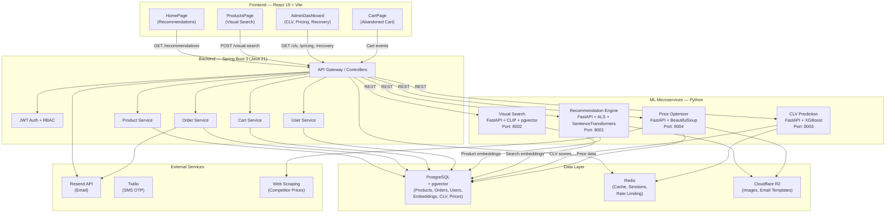

# Bao Cao: Cac Tinh Nang Nang Cao Cho He Thong Ecommerce

> **Ngay tao:** 06/07/2026  
> **Du an:** Ecommerce Platform  
> **Stack:** Spring Boot 3 (Java 21) + React 19 + PostgreSQL + Redis + Cloudflare R2

---

## Muc Luc

1. [Tom tat he thong hien tai](#1-tom-tat-he-thong-hien-tai)
2. [Tinh nang 1 — Product Recommendation Engine](#2-tinh-nang-1--product-recommendation-engine)
3. [Tinh nang 2 — Abandoned Cart Recovery](#3-tinh-nang-2--abandoned-cart-recovery)
4. [Tinh nang 3 — Visual Product Search](#4-tinh-nang-3--visual-product-search)
5. [Tinh nang 4 — Smart Price Optimization](#5-tinh-nang-4--smart-price-optimization)
6. [Tinh nang 5 — Customer Lifetime Value Prediction](#6-tinh-nang-5--customer-lifetime-value-prediction)
7. [Kien truc tong the](#7-kien-truc-tong-the)
8. [Bang so sanh & thu tu uu tien](#8-bang-so-sanh--thu-tu-uu-tien)

---

## 1. Tom tat he thong hien tai

### 1.1 Backend (Spring Boot)

| Thanh phan | Mo ta |
|---|---|
| Framework | Spring Boot 3.5.14, Java 21 |
| Database | PostgreSQL + Flyway migrations (14 entities) |
| ORM | Spring Data JPA (Hibernate) |
| Auth | JWT stateless + RBAC permission system |
| Cache | Redis |
| Storage | Cloudflare R2 (S3-compatible) |
| Email | Resend API |
| SMS | Twilio (OTP verification) |
| API Docs | SpringDoc OpenAPI (Swagger UI) |

**Cac entity chinh:** User, Role, Permission, Product, Category, Tag, ProductVariant, VariantValue, VariantOption, Cart, CartDetail, Order, OrderDetail.

### 1.2 Frontend (React)

| Thanh phan | Mo ta |
|---|---|
| Framework | React 19 + TypeScript |
| Build | Vite |
| Styling | Tailwind CSS v4 (CSS-first config) |
| Routing | React Router v7 |
| State | Zustand v5 (auth + cart, localStorage) |
| Data Fetching | TanStack React Query v5 |
| Forms | React Hook Form + Zod |
| UI Primitives | Radix UI + custom components |
| Notifications | Sonner toasts |

**Trang da co:** Home, Products, Product Detail, Cart, Checkout, Orders, Login, Register, Verify Email, Admin Dashboard, Admin Product/Order/Customer/Category Management.

---

## 2. Tinh nang 1 — Product Recommendation Engine

### 2.1 Mo ta chung

He thong goi y san pham ca nhan hoa cho tung nguoi dung dua tren lich su mua hang, hanh vi duyet web, va quan he giua cac san pham.

### 2.2 Tai sao nen lam

- Tang 10–30% doanh so theo cac nghien cuu cua Amazon, Netflix, Alibaba.
- Tan dung tot du lieu order/cart da co san trong he thong.
- Tao trai nghiem mua sam duoc ca nhan hoa, tang gia tri thuong hieu.

### 2.3 Mo ta giai phap & cong nghe

**Ky thuat recommendation can su dung:**

| Ky thuat | Mo ta | Uu diem | Nhuoc diem |
|---|---|---|---|
| **Collaborative Filtering** | Tim nhung nguoi dung co hanh vi tuong tu, goi y san pham họ da mua | Khong can hieu san pham, bat duoc taste moi |
| **Content-Based Filtering** | Tim san pham tuong tu dua tren thuoc tinh (danh muc, gia, tag) | Khong can du lieu nguoi dung khac |
| **Hybrid Filtering** | Ket hop ca hai phuong phap | Do chinh xac cao hon, giai quyet cold-start |

**Cong nghe ML de su dung:**

```
Python Microservice (FastAPI)
├── Model: ALS (Alternating Least Squares) — implicit library
│   └── Huấn luyện trên ma trận user-item interactions
├── Model: Sentence Transformers (for content embedding)
│   └── Encode product descriptions thành vector
├── Vector DB: PostgreSQL + pgvector extension
│   └── Lưu product embeddings, hỗ trợ ANN (Approximate Nearest Neighbor) search
└── API: FastAPI REST endpoints
    ├── POST /train          — Huấn luyện model
    ├── GET  /recommend/{userId}      — Top-N recommendations
    ├── GET  /similar/{productId}     — Similar products
    └── POST /feedback        — Log user click/purchase feedback
```

**Ma tran tuong tac (Interaction Matrix):**

```
Users  P1   P2   P3   P4   P5
UserA  5    3    0    1    2
UserB  4    0    0    2    5
UserC  0    2    5    3    0
```

Tu ma tran nay, ALS se hoc latent factors cho moi user va product, cho phep du doan rating cho cac cap chua tung tuong tac.

### 2.4 Du lieu can thu thap

- **Explicit feedback:** Ratings (neu co), reviews
- **Implicit feedback:** Views, clicks, add-to-cart, purchases, wishlist adds
- **Product features:** Category, tags, price, description, images

### 2.5 Cach tich hop voi he thong hien tai

**Backend (Spring Boot):**

```
POST /api/v1/recommendations
  Query: userId, limit (default 10)
  Response: List<ProductDTO> recommendations

GET /api/v1/recommendations/similar/{productId}
  Response: List<ProductDTO> similarProducts
```

**Frontend (React):**

- Trang Home: Hien thi "San pham goi y cho ban" o carousel
- Trang Product Detail: "San pham lien quan" ben duoi
- Trang Cart/Checkout: "San pham ban co the thich"
- Trang Products: "San pham hot" / "Trending"

### 2.6 Uoc tinh thoi gian & do kho

| Giai doan | Mo ta | Thoi gian |
|---|---|---|
| 1 | Thiet ke schema, migration, API endpoints | 2 ngay |
| 2 | Xay dung Python ML service (data pipeline + ALS) | 4 ngay |
| 3 | Tich hop pgvector, indexing san pham | 2 ngay |
| 4 | Frontend UI (carousel, recommendation sections) | 2 ngay |
| 5 | Testing, A/B testing framework | 2 ngay |
| | **Tong** | **~12 ngay** |

### 2.7 Hieu qua du kien

- Tang 15–25% Average Order Value (AOV)
- Tang 10–20% conversion rate
- Giam bounce rate o trang san pham

---

## 3. Tinh nang 2 — Abandoned Cart Recovery

### 3.1 Mo ta chung

Tu dong phat hien gio hang bi bo qua va gui chuoi email/SMS nhan nho co coupon giam gia de phuc hoi don hang.

### 3.2 Tai sao nen lam

- 60–75% gio hang online bi bo qua.
- Ty le phuc hoi trung binh 5–15% voi email nhan nho.
- ROI cao nhat trong tat ca cac chieu cua email marketing.

### 3.3 Mo ta giai phap & cong nghe

**Quy trinh hoat dong:**

```
[Khach hang them san pham vao gio]
         │
         ▼
[Background Job — chay moi 1 tieng]
         │
         ▼
[Kiem tra gio hang chua duoc checkout trong 1h]
         │
    ┌────┴────┐
    │  Co      │  Khong
    ▼         ▼
[Tao CartAbandonmentEvent]   [Ket thuc]
         │
         ▼
[Kiem tra da gui email chua?]
    (Redis cache: key = cartId)
         │
    ┌────┴────┐
    │  Chua    │  Roi
    ▼         ▼
[Gui email 1h sau]    [Kiem tra tiep]
         │
    ┌────┴────┐
    │  Chua mua│  Da mua
    ▼         ▼
[Gui email 24h + coupon 5%]
         │
    ┌────┴────┐
    │  Chua mua│  Da mua
    ▼         ▼
[Gui email 48h + coupon 10%]
```

**Cong nghe su dung:**

| Thanh phan | Cong nghe | Vai tro |
|---|---|---|
| Scheduler | Spring `@Scheduled` (cron: `0 0 * * * *`) | Chay job dinh ky |
| Event tracking | Bang `cart_abandonment_events` (PostgreSQL) | Luu tru su kien |
| Coupon | Bang `promo_codes`, ma duy nhat, han su dung | Giam gia 5–10% |
| Email sending | Resend API (da tich hop) | Gui email transactional |
| Email templates | HTML/CSS templates, luu o R2 | Template cho tung buoc |
| Rate limit | Redis counter | Tranh gui thua nhieu |

**Email sequences:**

| Email | Thoi gian | Noi dung | Coupon |
|---|---|---|---|
| 1 | 1h sau | "Quen thanh toan?" — nhan nho gio hang | Khong co |
| 2 | 24h sau | "San pham van con!" — show lai gio hang | 5% off |
| 3 | 48h sau | "Gio hang het han!" — tao khan cap | 10% off |

### 3.4 Database schema moi

```sql
-- Bang theo doi su kien abandoned cart
CREATE TABLE cart_abandonment_events (
    id              UUID PRIMARY KEY DEFAULT gen_random_uuid(),
    cart_id         UUID NOT NULL,
    user_id         UUID,
    email           VARCHAR(255),
    step            SMALLINT NOT NULL DEFAULT 1,  -- 1: email 1h, 2: email 24h, 3: email 48h
    coupon_code     VARCHAR(50),
    sent_at         TIMESTAMP,
    opened_at       TIMESTAMP,
    clicked_at      TIMESTAMP,
    recovered       BOOLEAN DEFAULT FALSE,
    recovered_order_id UUID,
    created_at      TIMESTAMP DEFAULT CURRENT_TIMESTAMP
);

-- Bang coupon/promo codes
CREATE TABLE promo_codes (
    id              UUID PRIMARY KEY DEFAULT gen_random_uuid(),
    code            VARCHAR(50) UNIQUE NOT NULL,
    discount_type   VARCHAR(20)  NOT NULL,  -- PERCENTAGE | FIXED_AMOUNT
    discount_value  DECIMAL(10,2) NOT NULL,
    min_order_value DECIMAL(10,2),
    valid_from      TIMESTAMP NOT NULL,
    valid_until     TIMESTAMP NOT NULL,
    max_uses        INTEGER,
    current_uses    INTEGER DEFAULT 0,
    is_active       BOOLEAN DEFAULT TRUE,
    for_abandoned_cart BOOLEAN DEFAULT FALSE,
    created_at      TIMESTAMP DEFAULT CURRENT_TIMESTAMP
);

-- Lua tracking pixel / link de track email opens
CREATE TABLE email_tracking (
    id              UUID PRIMARY KEY DEFAULT gen_random_uuid(),
    event_id        UUID REFERENCES cart_abandonment_events(id),
    action          VARCHAR(20),  -- SENT | OPENED | CLICKED | CONVERTED
    timestamp       TIMESTAMP DEFAULT CURRENT_TIMESTAMP,
    ip_address      VARCHAR(45),
    user_agent      TEXT
);
```

### 3.5 Cach tich hop voi he thong hien tai

**Backend (Spring Boot):**

```
POST /api/v1/cart-abandonment/send-reminder
  ├── Triggered by: @Scheduled job (mỗi 1 tiếng)
  ├── Logic: Lấy tất cả cart chưa chuyển thành order trong 1h
  ├── Tạo CartAbandonmentEvent
  ├── Gửi email via Resend
  └── Cập nhật Redis cache

POST /api/v1/admin/abandoned-carts
  ├── Query: startDate, endDate, status
  └── Response: Danh sách abandoned carts với stats

GET /api/v1/admin/abandoned-carts/{id}
  └── Response: Chi tiết event + email logs

POST /api/v1/admin/promo-codes
  └── Body: code, discountType, value, validFrom, validUntil

GET /api/v1/admin/recovery-stats
  └── Response: recovery rate, revenue recovered, email stats
```

**Frontend (React):**

- **Admin Dashboard:** Widget "Abandoned Cart Recovery" hien thi recovery rate, revenue da phuc hoi
- **Admin Reports:** Trang chi tiet cac abandoned carts, email sequences
- **Public:** Email template hien thi gio hang, nut "Mua ngay" (deeplink ve checkout voi coupon)

### 3.6 Uoc tinh thoi gian & do kho

| Giai doan | Mo ta | Thoi gian |
|---|---|---|
| 1 | Database schema + Flyway migration | 1 ngay |
| 2 | Service xu ly abandoned cart logic | 2 ngay |
| 3 | Email template design + sending via Resend | 1 ngay |
| 4 | Promo code system | 1 ngay |
| 5 | Admin dashboard reporting | 1 ngay |
| 6 | Testing + A/B testing (coupon amounts) | 1 ngay |
| | **Tong** | **~7 ngay** |

### 3.7 Hieu qua du kien

- 5–15% abandoned carts duoc phuc hoi
- Tang 5–10% overall revenue
- ROI ~$36 moi $1 chi cho email marketing

---

## 4. Tinh nang 3 — Visual Product Search

### 4.1 Mo ta chung

Cho phep nguoi dung tim kiem san pham bang hinh anh thay vi text. Upload anh hoac chon anh tu thu vien, he thong se tra ve cac san pham tuong tu.

### 4.2 Tai sao nen lam

- Dac biet phu hop voi thoi trang, noi that — nguoi dung thuong muon tim "cai nay" nhung khong biet go ten.
- Tang 20–40% engagement tren mobile.
- Trai nghiem nguoi dung hien dai, giong nhhu Google Lens, Pinterest Lens.

### 4.3 Mo ta giai phap & cong nghe

**Quy trinh hoat dong:**

```
[Nguoi dung tai anh len]
         │
         ▼
[Frontend resize + chuyen thanh base64 hoac upload len R2]
         │
         ▼
[Python Vision Service nhan request]
         │
         ▼
[CLIP model encode anh thanh vector (512–768 dims)]
         │
         ▼
[ANN search trong pgvector — tim top-K san pham gan nhat]
         │
         ▼
[Tra ve danh sach product IDs + similarity scores]
         │
         ▼
[Frontend hien thi ket qua]
```

**Cong nghe su dung:**

| Thanh phan | Cong nghe | Chi tiet |
|---|---|---|
| **Image Encoder** | OpenAI CLIP (ViT-B/32 or ViT-L/14) | Chuyen anh thanh 512-dimensional vector |
| **Vector Database** | PostgreSQL + pgvector | ANN search voi HNSW index |
| **ML Service** | FastAPI (Python) | Xu ly anh, encode, search |
| **Image Processing** | Pillow (Python) | Resize, normalize anh |
| **Frontend** | React + react-dropzone | Upload UI |

**CLIP Model hoat dong:**

CLIP (Contrastive Language-Image Pre-training) duoc pre-trained tren 400 trieu cap anh-text. No hoc cach map anh va text vao cung mot khong gian vector. Hai anh tuong tu se co vector gan nhau.

```
Anh san pham A  ──encode──▶  v_A [0.2, -0.5, 0.8, ...]
Anh nguoi dung U ──encode──▶  v_U [0.21, -0.49, 0.79, ...]

Cosine Similarity(v_A, v_U) ≈ 0.98 → San pham A rat tuong tu!
```

**pgvector setup:**

```sql
-- Enable pgvector extension
CREATE EXTENSION IF NOT EXISTS vector;

-- Them cot vector cho san pham
ALTER TABLE products ADD COLUMN embedding vector(512);

-- Tao HNSW index cho ANN search
CREATE INDEX ON products USING hnsw (embedding vector_cosine_ops);

-- Khoa anh luc upload (trigger hoac manual)
-- Cached trong bang products
```

### 4.4 Hien tai da co gi & can bo sung

**Da co trong he thong:**
- Upload anh san pham (R2 storage) — chi can them encoding step
- Product images URLs luu trong bang `products`

**Can them:**
- Python microservice cho CLIP encoding
- Migration them cot `embedding vector(512)` vao bang `products`
- Background job encode lai anh cu (batch processing)
- API endpoint search-by-image

### 4.5 Cach tich hop voi he thong hien tai

**Backend (Spring Boot):**

```
POST /api/v1/products/visual-search
  ├── Body: Multipart file (image) hoac imageUrl
  ├── Logic: Forward to Python vision service
  └── Response: List<ProductDTO> similarProducts + scores

GET /api/v1/admin/products/rebuild-embeddings
  └── Trigger: Batch encode all product images
```

**Python Vision Service:**

```
FastAPI Service (port 8001)
├── POST /encode-image
│   └── Input: image file, Output: vector embedding
├── POST /search-similar
│   ├── Input: image file hoac embedding vector
│   └── Output: List[productId, similarityScore]
└── GET /health
```

**Frontend (React):**

- **Trang Products:** Nut "Tim bang hinh anh" (icon camera) o thanh tim kiem
- **Search Modal:** Full-screen modal voi drag-drop upload, preview, loading state
- **Ket qua:** Grid san pham voi similarity score badge (VD: "98% match")
- **Camera mode:** (Optional) Sử dụng device camera tren mobile

### 4.6 Uoc tinh thoi gian & do kho

| Giai doan | Mo ta | Thoi gian |
|---|---|---|
| 1 | Thiet ke pgvector schema + migration | 1 ngay |
| 2 | Xay dung Python Vision Service (CLIP encoding) | 3 ngay |
| 3 | Batch encode all existing product images | 1 ngay |
| 4 | API tich hop (Spring Boot → Python service) | 1 ngay |
| 5 | Frontend UI (upload modal, results grid) | 2 ngay |
| 6 | Performance optimization + caching | 1 ngay |
| | **Tong** | **~9 ngay** |

### 4.7 Hieu qua du kien

- Tang 15–30% search engagement
- Giam bounce rate o trang search
- Trai nghiem khac biet, tao impression công nghệ

---

## 5. Tinh nang 4 — Smart Price Optimization

### 5.1 Mo ta chung

He thong toi uu hoa gia ban dua tren phan tich doi thu truong, hanh vi khach hang, va muc ton kho, nham toi da hoa loi nhuan.

### 5.2 Tai sao nen lam

- Tang loi nhuan 5–15% khi ap dung dung cách.
- Tu dong hoa viec thay doi gia ma khong can thu cong.
- Canh tranh voi doi thu nhanh chóng hơn.

### 5.3 Mo ta giai phap & cong nghe

**Cac loai pricing strategy:**

| Chien luoc | Mo ta | Vi du |
|---|---|---|
| **Competitor-Based** | Canh tranh gia voi doi thu | Ban re hon Shopee 5% |
| **Demand-Based** | Gia cao hon khi kho, thap hon khi nhieu hang | Giam 20% khi ton kho > 100 |
| **Time-Based** | Gia thay doi theo thoi diem | Cuoi tuan giam 10% |
| **Bundle Pricing** | Gom nhung san pham ban cham thanh goi | Mua 3 tang 1 |
| **Elasticity-Based** | Du doan doanh so theo gia, chon gia toi uu | Model price elasticity curve |

**Cong nghe su dung:**

| Thanh phan | Cong nghe | Vai tro |
|---|---|---|
| **Price Engine** | Python Microservice (FastAPI) | Tinh toan gia toi uu |
| **Web Scraping** | Python (BeautifulSoup + Playwright) | Lay gia doi thu tu website |
| **Database** | PostgreSQL (bang `competitor_prices`, `price_history`) | Luu lich su gia |
| **Scheduler** | Spring `@Scheduled` | Cap nhat gia dinh ky |
| **Analytics** | Python (pandas, scipy) | Price elasticity analysis |
| **Alerting** | Spring Boot + Email | Thong bao khi gia thay doi lon |

**Price Optimization Model:**

```
Price_optimal = f(Demand_elasticity, Competitor_price, Inventory_level, Time_of_year)

Ví dụ đơn giản hóa:
- Base price: 100
- Competitor price: 95 → Giá đề xuất: 94 (re thua 1%)
- Inventory > 100 → Giảm thêm 5%
- Weekend → Tăng 3%
→ Final price: 94 × 0.95 × 1.03 ≈ 92
```

**Chi tiet tung chien luoc:**

**1. Competitor-Based Pricing:**
```python
def competitor_price(product):
    competitor_prices = db.get_competitor_prices(product.sku)
    if not competitor_prices:
        return product.base_price
    
    min_competitor = min(competitor_prices)
    # Ban re hon doi thu thap nhat 1-5%
    return min_competitor * 0.98
```

**2. Inventory-Based Pricing:**
```python
def inventory_price(product):
    if product.inventory > 100:
        return product.base_price * 0.85  # Giam 15%
    elif product.inventory > 50:
        return product.base_price * 0.95  # Giam 5%
    elif product.inventory < 10:
        return product.base_price * 1.10  # Tang 10% (rare)
    return product.base_price
```

**3. Price Elasticity (nâng cao):**
```python
# Y = alpha * e^(beta * price_change)
# Tim price_change toi uu: d(profit)/d(price) = 0
# Su dung historical data de uoc luong elasticity coefficient
```

### 5.4 Database schema moi

```sql
-- Bang theo doi gia doi thu
CREATE TABLE competitor_prices (
    id              UUID PRIMARY KEY DEFAULT gen_random_uuid(),
    product_sku     VARCHAR(100),
    competitor_name VARCHAR(100),
    product_url     TEXT,
    price           DECIMAL(12,2),
    currency        VARCHAR(3) DEFAULT 'VND',
    scraped_at      TIMESTAMP DEFAULT CURRENT_TIMESTAMP
);

-- Lich su gia san pham
CREATE TABLE price_history (
    id              UUID PRIMARY KEY DEFAULT gen_random_uuid(),
    product_id      UUID NOT NULL,
    old_price       DECIMAL(12,2),
    new_price       DECIMAL(12,2),
    reason          VARCHAR(100),  -- COMPETITOR, INVENTORY, DEMAND, MANUAL
    auto_updated    BOOLEAN DEFAULT FALSE,
    changed_by      UUID,         -- user_id neu MANUAL
    changed_at      TIMESTAMP DEFAULT CURRENT_TIMESTAMP
);

-- Bang cau hinh pricing rules
CREATE TABLE pricing_rules (
    id              UUID PRIMARY KEY DEFAULT gen_random_uuid(),
    name            VARCHAR(100),
    rule_type       VARCHAR(50),  -- COMPETITOR, INVENTORY, TIME, BUNDLE
    condition_json  JSONB,        -- {"field": "inventory", "operator": "gt", "value": 100}
    action_json     JSONB,        -- {"type": "discount_percent", "value": 15}
    priority        INTEGER DEFAULT 0,
    is_active       BOOLEAN DEFAULT TRUE,
    valid_from      TIMESTAMP,
    valid_until     TIMESTAMP,
    created_at      TIMESTAMP DEFAULT CURRENT_TIMESTAMP
);

-- Bang doi thu
CREATE TABLE competitors (
    id              UUID PRIMARY KEY DEFAULT gen_random_uuid(),
    name            VARCHAR(100) NOT NULL,
    website         TEXT,
    logo_url        TEXT,
    priority        INTEGER DEFAULT 0,  -- 1 = cao nhat (canh tranh chinh)
    scrape_enabled  BOOLEAN DEFAULT TRUE,
    created_at      TIMESTAMP DEFAULT CURRENT_TIMESTAMP
);
```

### 5.5 Cach tich hop voi he thong hien tai

**Backend (Spring Boot):**

```
GET /api/v1/admin/price-optimization/dashboard
  └── Response: Current pricing stats, pending changes

GET /api/v1/admin/price-optimization/suggestions
  └── Response: List<ProductDTO> with suggested new prices

POST /api/v1/admin/price-optimization/apply
  └── Body: List<{productId, newPrice, reason}>

GET /api/v1/admin/price-optimization/history
  └── Query: productId, startDate, endDate

POST /api/v1/admin/competitors
  └── Body: competitor name, website

GET /api/v1/admin/competitors/{id}/scrape
  └── Trigger: Manual scrape competitor prices

GET /api/v1/admin/pricing-rules
POST /api/v1/admin/pricing-rules
PUT  /api/v1/admin/pricing-rules/{id}
```

**Frontend (React):**

- **Admin Dashboard:** Widget hien thi gia hien tai vs gia doi thu, alert khi nen thay doi gia
- **Admin Products:** Icon "Smart Price" ben canh gia, hien thi gia de xuat + so luong
- **Admin Reports:** Bieu do price history, doanh so theo gia, elasticity chart
- **Admin Settings:** Cau hinh pricing rules, competitors

### 5.6 Uoc tinh thoi gian & do kho

| Giai doan | Mo ta | Thoi gian |
|---|---|---|
| 1 | Database schema + pricing rules engine | 2 ngay |
| 2 | Web scraping service (BeautifulSoup + Playwright) | 3 ngay |
| 3 | Price optimization engine (Python) | 3 ngay |
| 4 | Auto-update integration (Spring Scheduler) | 2 ngay |
| 5 | Admin UI (dashboard, rules, history) | 2 ngay |
| 6 | Manual override + audit trail | 1 ngay |
| | **Tong** | **~13 ngay** |

### 5.7 Hieu qua du kien

- Tang loi nhuan 5–15%
- Giam thoi gian thu cong thay doi gia 80%
- Canh tranh tot hon voi doi thu

---

## 6. Tinh nang 5 — Customer Lifetime Value Prediction

### 6.1 Mo ta chung

Du doan gia tri khach hang trong tuong lai (CLV) de phan nhom, uu tien cham soc, va toi uu chi phi marketing.

### 6.2 Tai sao nen lam

- Chi phi thu hut khach hang moi gap 5–25 lan chi phi giu chanh.
- Xac dinh VIP customers de cham soc dac biet.
- Phan bo ngan sach marketing hieu qua hon.

### 6.3 Mo ta giai phap & cong nghe

**Mo hinh CLV co ban:**

```
CLV = (Average Order Value) × (Purchase Frequency) × (Customer Lifespan)
```

**Mo hinh nang cao (Machine Learning):**

```
CLV_3y = Σ(t=1 to 36) [P(purchase_t) × Expected_Value_t] / (1 + r)^t

Trong do:
- P(purchase_t) = Xác suất khách quay lại ở tháng t
- Expected_Value_t = Giá trị đơn hàng dự đoán
- r = discount rate
```

**Cong nghe su dung:**

| Thanh phan | Cong nghe | Vai tro |
|---|---|---|
| **ML Model** | Python (scikit-learn, LightGBM, XGBoost) | Du doan CLV |
| **Feature Engineering** | Python (pandas, numpy) | Tinh RFM features |
| **Database** | PostgreSQL (bang customer_segments) | Luu ket qua |
| **Scheduler** | Spring `@Scheduled` | Tinh toan dinh ky |
| **Visualization** | React (recharts) | Hien thi charts |

**RFM Analysis (Baseline):**

| Feature | Mo ta | Cach tinh |
|---|---|---|
| **Recency** | Lan cuoi mua cach day bao lau | days(now - last_order_date) |
| **Frequency** | Tan so mua hang | Tong so don hang |
| **Monetary** | Tong chi tieu | Tong revenue tu khach |

**ML Features cho XGBoost:**

```python
features = [
    "total_orders",              # Tong so don hang
    "total_spent",               # Tong chi tieu
    "avg_order_value",           # Gia tri trung binh moi don
    "recency_days",              # So ngay tu lan mua cuoi
    "days_since_first_order",    # So ngay tu lan mua dau tien
    "order_frequency_30d",       # Tan so mua trong 30 ngay qua
    "order_frequency_90d",       # Tan so mua trong 90 ngay qua
    "product_diversity",         # So luong san pham khac nhau
    "category_diversity",         # So danh muc da mua
    "returning_customer",        # Co quay lai mua khong
    "abandoned_cart_count",      # So lan bo gio hang
    "refund_rate",               # Ty le hoan tien
    "days_since_signup",         # Thoi gian tu dang ky
]
```

**Customer Segmentation:**

```
Segment      |   Mo ta                              |   Hanh dong
-------------|--------------------------------------|------------------
Champions    |   Chi tiêu nhiều, mua thường xuyên   |   VIP program, early access
Loyal        |   Muốn thường xuyên, giá trị OK      |   Loyalty rewards, upsell
Potential    |   Mới mua, chi tiêu trung bình        |   Nurture campaigns
At-Risk      |   Đã lâu không mua                    |   Win-back campaigns
Lost         |   Rất lâu không mua                   |   Aggressive discounts
New          |   Mới đăng ký                        |   Onboarding, welcome offers
Cant Lose    |   Từng mua nhiều, gần đây chưa mua   |   Priority win-back
Hibernating  |   Ít hoạt động                        |   Reactivation offers
```

### 6.4 Database schema moi

```sql
-- Bang luu CLV score cho tung khach hang
CREATE TABLE customer_clv_scores (
    id              UUID PRIMARY KEY DEFAULT gen_random_uuid(),
    user_id         UUID NOT NULL REFERENCES users(id),
    clv_30d         DECIMAL(12,2),   -- CLV 30 ngay
    clv_90d         DECIMAL(12,2),   -- CLV 90 ngay
    clv_1y          DECIMAL(12,2),   -- CLV 1 nam
    clv_predicted   DECIMAL(12,2),   -- CLV du doan (3 nam)
    
    -- RFM scores
    recency_score   INTEGER,         -- 1-5
    frequency_score INTEGER,         -- 1-5
    monetary_score  INTEGER,         -- 1-5
    rfm_segment     VARCHAR(50),     -- Champions, Loyal, At-Risk, etc.
    
    churn_probability   DECIMAL(5,4),  -- Xac suất churn (0-1)
    
    last_calculated_at  TIMESTAMP DEFAULT CURRENT_TIMESTAMP,
    model_version       VARCHAR(20),
    created_at          TIMESTAMP DEFAULT CURRENT_TIMESTAMP,
    updated_at          TIMESTAMP DEFAULT CURRENT_TIMESTAMP
);

-- Bang theo doi lich su segmentation
CREATE TABLE customer_segment_history (
    id              UUID PRIMARY KEY DEFAULT gen_random_uuid(),
    user_id         UUID NOT NULL REFERENCES users(id),
    segment         VARCHAR(50) NOT NULL,
    reason          TEXT,
    calculated_at   TIMESTAMP DEFAULT CURRENT_TIMESTAMP
);

-- Bang theo doi chi so RFM chi tiet
CREATE TABLE customer_rfm (
    id              UUID PRIMARY KEY DEFAULT gen_random_uuid(),
    user_id         UUID NOT NULL REFERENCES users(id),
    period          DATE NOT NULL,           -- Ngay tinh toan
    recency         INTEGER,                  -- So ngay tu lan mua cuoi
    frequency       INTEGER,                  -- So don hang
    monetary        DECIMAL(12,2),           -- Tong chi tieu
    created_at      TIMESTAMP DEFAULT CURRENT_TIMESTAMP
);

-- Bang cau hinh segmentation rules
CREATE TABLE segment_rules (
    id              UUID PRIMARY KEY DEFAULT gen_random_uuid(),
    segment_name     VARCHAR(50) NOT NULL,
    segment_color    VARCHAR(7),              -- Hex color for UI
    conditions_json  JSONB NOT NULL,
    priority         INTEGER DEFAULT 0,
    is_active        BOOLEAN DEFAULT TRUE,
    created_at       TIMESTAMP DEFAULT CURRENT_TIMESTAMP
);
```

### 6.5 Cach tich hop voi he thong hien tai

**Backend (Spring Boot):**

```
GET /api/v1/admin/customers/{id}/clv
  └── Response: CLV score, RFM details, segment, churn probability

GET /api/v1/admin/customers/segments
  └── Response: List segments with counts, avg CLV

GET /api/v1/admin/customers/segments/{segment}
  └── Response: List customers in segment with key metrics

POST /api/v1/admin/clv/calculate
  └── Trigger: Manual recalculation for all/customers

GET /api/v1/admin/clv/export
  └── Response: CSV/Excel export of all CLV data

GET /api/v1/admin/clv/report
  └── Response: Summary stats, segment distribution chart data
```

**Public-facing (optional):**

```
GET /api/v1/users/me/clv-summary
  └── Response: Current tier, points, next tier progress
```

**Frontend (React):**

- **Admin Customer Detail:** Section moi hien thi CLV score, RFM radar chart, segment badge
- **Admin Customers List:** Cot "CLV" sortable, filter theo segment
- **Admin Reports:** Bieu do phan bo segment, CLV trends, churn prediction chart
- **Customer Sidebar:** Hien thi "Bronze/Silver/Gold/VIP" badge neu ap dung

### 6.6 Uoc tinh thoi gian & do kho

| Giai doan | Mo ta | Thoi gian |
|---|---|---|
| 1 | Database schema + RFM calculation service | 2 ngay |
| 2 | Python ML service (XGBoost model training) | 3 ngay |
| 3 | Customer segmentation engine | 2 ngay |
| 4 | Scheduled job (weekly recalculation) | 1 ngay |
| 5 | Admin UI (CLV scores, segments, charts) | 2 ngay |
| 6 | Marketing action triggers (email, etc.) | 1 ngay |
| 7 | Testing + model validation | 1 ngay |
| | **Tong** | **~12 ngay** |

### 6.7 Hieu qua du kien

- Giam 20–30% churn rate voi win-back campaigns dua tren CLV
- Tang 15–25% LTV thong qua VIP programs
- Phan bo marketing budget hieu qua hon 40%

---

## 7. Kien truc tong the

### 7.1 System Architecture Diagram



### 7.2 Communication Patterns

| Interaction | Pattern | Protocol |
|---|---|---|
| Frontend → Backend | Synchronous | REST (HTTP) |
| Backend → ML Services | Synchronous | REST (HTTP) |
| ML Training Jobs | Async | Spring `@Async` + Scheduled |
| Email Sending | Async | Spring `@Async` |
| Web Scraping | Scheduled | Spring `@Scheduled` |
| CLV Recalculation | Scheduled | Spring `@Scheduled` (weekly) |

### 7.3 Deployment Strategy

```
┌─────────────────────────────────────────────┐
│                  Cloudflare                   │
│  ┌─────────┐  ┌──────────┐  ┌────────────┐  │
│  │   CDN   │  │  R2 CDN  │  │   Pages    │  │
│  └────┬────┘  └────┬─────┘  └────────────┘  │
└───────┼────────────┼─────────────────────────┘
        │            │
        ▼            ▼
┌─────────────────────────────────────────────┐
│              Load Balancer (Nginx)            │
└──────────┬────────────────────┬─────────────┘
           │                    │
           ▼                    ▼
┌──────────────────┐  ┌────────────────────────┐
│  Spring Boot JAR  │  │  Python ML Services    │
│  (Main Backend)  │  │  - REC (8001)          │
│  Port: 8080       │  │  - VISION (8002)       │
│                   │  │  - CLV (8003)         │
│                   │  │  - PRICE (8004)       │
└──────┬────────────┘  └────────────┬───────────┘
       │                            │
       ▼                            ▼
┌─────────────┐           ┌─────────────────────┐
│ PostgreSQL  │           │ Redis (Cache/Sess)  │
│ + pgvector │           └─────────────────────┘
└─────────────┘
```

**Co the deploy tren:**
- VPS (DigitalOcean, Linode) voi Docker Compose
- Cloudflare Tunnel
- Hoac Cloud Run (GCP) cho Spring Boot + Python services

---

## 8. Bang so sanh & thu tu uu tien

### 8.1 Bang so sanh tong hop

| Tinh nang | Do kho | Thoi gian | Loi nhuan | Ky thuat ML | Lam lai |
|-----------|--------|-----------|-----------|-------------|---------|
| **1. Recommendation Engine** | Trung binh | 12 ngay | Cao | Co | Co |
| **2. Abandoned Cart Recovery** | De | 7 ngay | Rat cao | Khong | Khong |
| **3. Visual Search** | Cao | 9 ngay | Trung binh | Co | Co |
| **4. Smart Price Optimization** | Trung binh | 13 ngay | Cao | Co | Khong |
| **5. CLV Prediction** | Trung binh | 12 ngay | Cao | Co | Co |

### 8.2 Thu tu uu tien de trien khai

```
Thu tu  |  Tinh nang                    |  Ly do
--------|-------------------------------|----------------------------------
   1    |  Abandoned Cart Recovery      |  De lam nhat, hieu qua nhanh nhat,
        |                               |  chi phi thap, tan dung Resend co san
--------|-------------------------------|----------------------------------
   2    |  Product Recommendation       |  Vo co hieu qua cao, tan dung data
        |                               |  co san, tang trach nghiem nguoi dung
--------|-------------------------------|----------------------------------
   3    |  CLV Prediction               |  Giup marketing hieu qua hon,
        |                               |  giam chi phi acquire khach hang moi
--------|-------------------------------|----------------------------------
   4    |  Visual Product Search         |  Trai nghiem nguoi dung noi bat,
        |                               |  khac biet voi doi thu
--------|-------------------------------|----------------------------------
   5    |  Smart Price Optimization      |  Can nhieu du lieu doi thu,
        |                               |  co the phuc tap trong viec scraping
```

### 8.3 Roadmap tong quat

```
Phase 1 (Tuan 1-2)
├── Abandoned Cart Recovery
│   ├── Database schema
│   ├── Email service integration
│   ├── Scheduled job
│   └── Admin reporting
└── Recommendation Engine
    ├── Database schema + pgvector
    ├── Python ML service scaffold
    └── Basic API integration

Phase 2 (Tuan 3-4)
├── Recommendation Engine (tiep)
│   ├── Model training pipeline
│   ├── Frontend UI
│   └── A/B testing
├── CLV Prediction
│   ├── RFM calculation
│   ├── Python ML model
│   └── Admin UI
└── Visual Search
    ├── CLIP integration
    ├── Batch encoding
    └── Frontend UI

Phase 3 (Tuan 5-6)
├── Smart Price Optimization
│   ├── Web scraping service
│   ├── Pricing rules engine
│   ├── Auto-update integration
│   └── Admin UI
└── Advanced Features
    ├── A/B testing framework
    ├── Analytics dashboard
    └── Performance optimization
```

### 8.4 Chi phi uoc tinh (neu can thue cloud)

| Dich vu | Chi phi uoc tinh/thang |
|---|---|
| VPS (4 vCPU, 8GB RAM) | $20–40 |
| PostgreSQL managed (2GB) | $15–20 |
| Redis managed (1GB) | $10–15 |
| Cloudflare R2 (Storage + Bandwidth) | $5–10 |
| AI/ML APIs (neu dung OpenAI CLIP hosted) | $0–50 |
| **Tong uoc tinh** | **$50–135/thang** |

---

## Ket luan

5 tinh nang tren duoc chon dua tren:

1. **Tinh kha thi trien khai** voi codebase hien tai (Spring Boot + React + PostgreSQL)
2. **Ky thuat ML phu hop** — khong qua phuc tap nhung co hieu qua thuc su
3. **Tan dung cac tich hop san** — Resend, R2, Redis, Twilio deu co san
4. **Co ROI ro rang** — moi tinh nang deu co nghien cuu chung minh hieu qua
5. **De xuat trien khai theo thu tu uu tien** — bat dau tu de lam nhat, hieu qua nhanh nhat

Neu muon bat dau ngay, **Abandoned Cart Recovery** la lua chon tot nhat de trien khai truoc.
